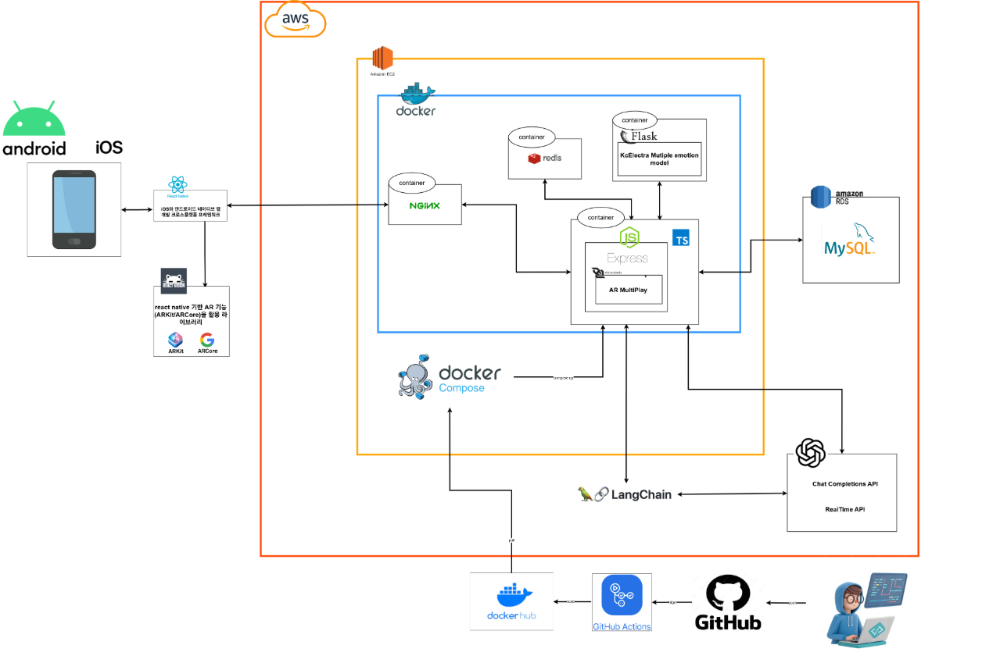
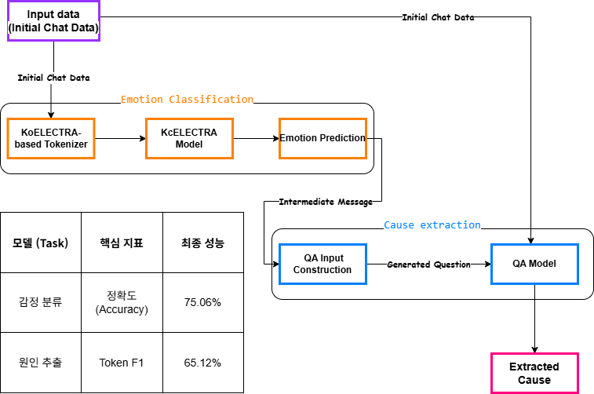

# 🌿 InnerEcho Backend

## 1인 가구를 위한 AR 반려식물 기반 교감 시스템

### `1. 프로젝트 소개`

“혼자지만 외롭지 않게, 내 공간에 피어나는 작은 위로”

현대 사회에서 1인 가구는 빠르게 증가하고 있지만,
그에 비해 고립감·우울감·정서적 소진은 더욱 심해지고 있습니다.
InnerEcho는 이러한 문제를 해결하기 위해 기획된 AR 정서 케어 애플리케이션입니다.

이 서비스는 단순한 게임을 넘어, AR(증강현실) 로 현실 공간에 식물을 배치하고 AI 기반 감정 분석·원인 추론 으로 사용자의 감정을 이해하며, 미션/대화/일지 기록 을 통해 스스로를 돌보는(Self-care) 경험을 제공합니다.

사용자는 식물과의 상호작용을 통해 감정을 표현하고, 성장 과정 속에서 위로·동기부여·정서적 안정감을 얻게 됩니다.

### 2. `나의 역할 및 기여도`

본 프로젝트에서 저는 DB 설계와 감정 분석 AI의 핵심 기능을 담당했습니다.

🏆 총 기여도: 약 30%

🛠 1) Database & System Design

- 사용자–식물–미션–커뮤니티–리포트로 이어지는 도메인 전체 ERD 설계
- AR 상호작용, 감정 기록, 미션 시스템을 위한 백엔드 API 전반 구현
- 데이터 정합성, 이벤트 흐름을 고려한 시스템 구조 설계

🧠 2) AI Model Engineering (감정 분석 & 원인 추론)

- 한국어 감정 분석을 위해 KcELECTRA 모델 채택
- 5가지 핵심 감정(기쁨·슬픔·분노·불안·평온) 분류를 위한 Output Layer 재구성 및 Fine-tuning 수행
- 백엔드 서비스와 실시간 연동 가능한 Inference API 구축

### `3. 주요 기능`

InnerEcho 백엔드는 AR·AI·커뮤니티·데이터 분석을 하나의 흐름으로 연결하는
6가지 핵심 엔진을 제공합니다.

🌱 1) AR 반려식물 상호작용 (AR Interaction Engine)

- Plane Detection & Anchor 기반 AR 배치
- 터치·음성·제스처 입력에 따라 식물의 표정·자세·크기 실시간 변화 처리

💬 2) 감정 분석 & 원인 추론 (Emotion & Cause Analysis)

- NLP 파이프라인으로 감정·강도·맥락 분석
- 데이터 기반으로 “왜 그런 감정이 발생했는지” 원인 후보 제공

🎯 3) 적응형 미션 시스템 (Adaptive Mission System)

- 온보딩 + 대화 + 활동 데이터를 기반으로 하루/주간 맞춤 미션 자동 생성
- 완료율·패턴에 따라 난이도/빈도를 동적으로 조절

📘 4) 성장 일지 & 리포트 (Auto Diary & Report)

- 대화, 물주기, AR 교감, 감정 변화 등 주요 이벤트 자동 기록
- 월간/연간 리포트 자동 생성

🤝 5) 소셜 커뮤니티 (Connected Care)

- 감정 일지·식물 성장 스냅샷 공유
- 댓글·응원 스티커·챌린지 기반 사회적 연결 제공

🔄 6) 실시간 상호작용 엔진 (Realtime Interaction)

- 음성 기반 상호작용(STT/TTS)
- WebSocket 기반 AR 실시간 상태 교환
- Access Ticket 기반 보안 설계

### `4. 기술 스택`

### 5. `AI 파이프라인`

## AI Pipeline Overview

## 감정 추론 파이프라인

## 모델 학습 파이프라인

### 6. `마무리`

InnerEcho는
“기술이 사람의 감정을 어떻게 보듬을 수 있는가”
라는 질문에서 출발한 프로젝트입니다.

저는 이 프로젝트에서

KcELECTRA 기반 감정 분석 엔진 구축

AR 경험과 데이터 흐름을 연결하는 백엔드 아키텍처 설계

사용자 감정·행동 데이터를 기반으로 한 정서 케어 로직 구현
에 집중했습니다.

앞으로도 데이터·AI·경험 디자인을 결합해
사람의 마음에 닿는 따뜻한 서비스를 만드는 개발자로 성장하고자 합니다.
